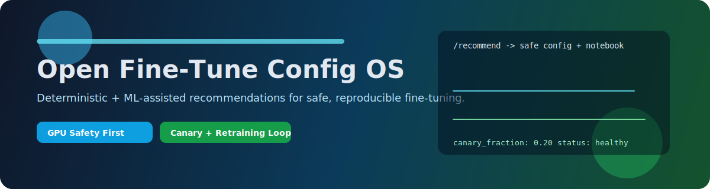
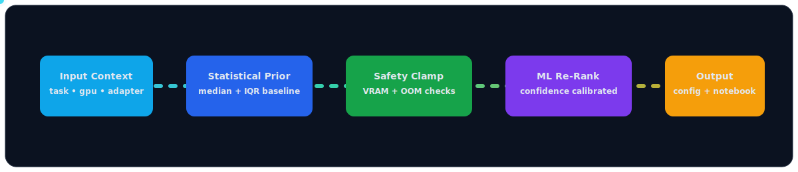
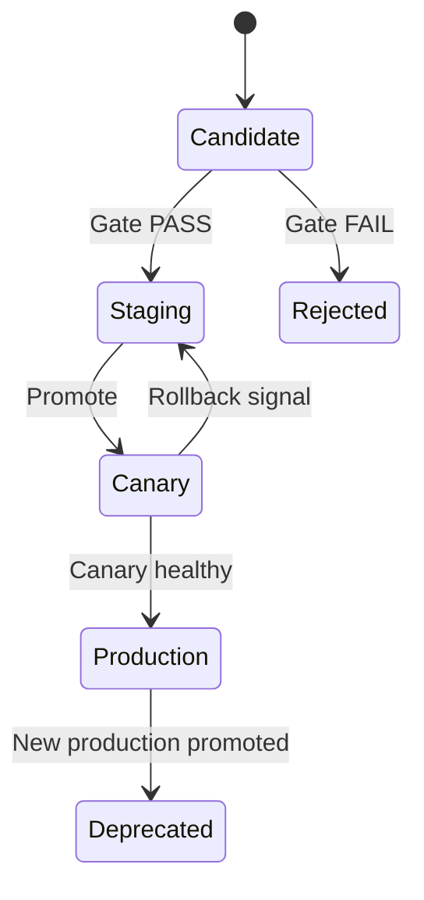
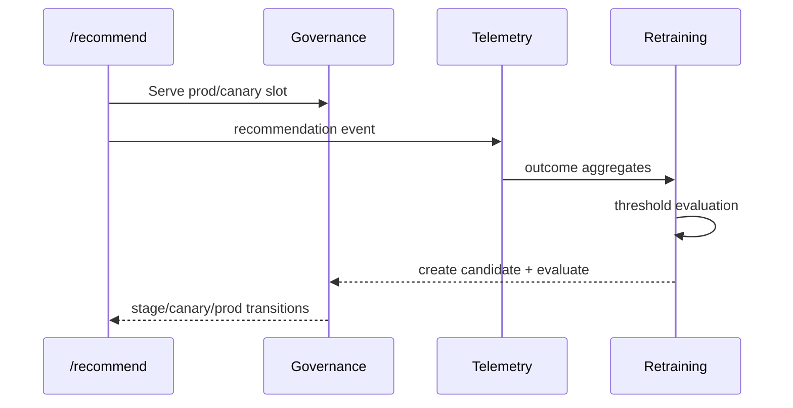

# Open Fine-Tune Config OS

<p align="center">
  
</p>

<p align="center">
  
  
  
  
</p>

Deterministic + ML-assisted configuration intelligence for fine-tuning workloads.

This project recommends safe hyperparameters, adapts to platform/GPU constraints, generates reproducible notebooks, and supports production controls like canary rollout, governance gates, telemetry ingestion, and retraining triggers.

## Why This Exists

Most fine-tuning attempts fail because of one or more of these issues:

- wrong hyperparameters copied from random blog posts
- OOM from GPU mismatch
- broken dependency versions
- non-reproducible notebooks
- no guardrails for production rollout

`open-finetune-config-os` solves those with a reproducible recommendation pipeline and operational safety controls.

---

## Visual Pipeline

<p align="center">
  
</p>


---

## Core Capabilities

- Dataset normalization and deduplication from mixed schema JSONL sources
- Statistical priors by `(task_type, model_size_bucket, adapter_type)`
- GPU-aware safety checks and VRAM risk control
- Strategy routing: `auto`, `deterministic`, `hybrid`, `hybrid_ml`
- Dependency pinning by platform profile
- Reproducible notebook generation via templates
- Governance state machine: candidate -> staging -> canary -> production
- Canary traffic split with confidence/risk monitoring
- Telemetry ingestion (`run-start` / `run-complete`) with retraining triggers
- Evaluation gates to block unsafe promotions

---

## Production Lifecycle





---

## Quick Start

### 1) Local (venv)

```bash
curl -LsSf https://astral.sh/uv/install.sh | sh
export PATH="$HOME/.local/bin:$PATH"
uv venv --clear .venv
. .venv/bin/activate
uv pip install -r requirements.txt
```

### 2) Train engine artifacts

```bash
PYTHONPATH=src python3 scripts/train_ml_reranker.py \
  --dataset finetuning_configs_final.jsonl,Fixed.jsonl,raw_user_dataset.jsonl \
  --out-model artifacts/ml_reranker.joblib \
  --out-metrics artifacts/ml_reranker_metrics.json

PYTHONPATH=src python3 scripts/train_hp_predictor.py \
  --dataset finetuning_configs_final.jsonl,Fixed.jsonl,raw_user_dataset.jsonl \
  --out-model artifacts/hp_predictor.joblib \
  --out-metrics artifacts/hp_predictor_metrics.json
```

### 3) Run API

```bash
PYTHONPATH=src uvicorn ft_config_engine.api:app --host 0.0.0.0 --port 8000
```

### 4) Smoke request

```bash
curl -X POST http://127.0.0.1:8000/recommend \
  -H "Content-Type: application/json" \
  -d '{
    "platform":"colab",
    "plan":"free",
    "task_type":"instruction_following",
    "adapter_type":"qlora",
    "model_size_bucket":"medium",
    "strategy":"auto",
    "include_notebook":false
  }'
```

---

## Docker and Full Stack

### Backend only

```bash
docker build -t ft-config-engine:latest .
docker run --rm -p 8000:8000 ft-config-engine:latest
```

### Backend + Postgres + Frontend

```bash
docker compose up --build
```

- API: `http://localhost:8000`
- UI: `http://localhost:3000`
- Postgres: `localhost:5432`

---

## API Surface

Main endpoints:

- `POST /recommend`
- `GET /health`
- `GET /metrics`
- `GET /governance/model`
- `GET /governance/events`
- `GET /governance/canary/summary`
- `POST /governance/promote`
- `POST /governance/rollback`
- `POST /telemetry/run-start`
- `POST /telemetry/run-complete`
- `GET /telemetry/recent`
- `GET /retraining/status`
- `POST /retraining/check`

---

## Configuration (Environment)

Critical variables:

- `FT_CONFIG_DATASET_PATH`
- `FT_CONFIG_ML_RERANKER_PATH`
- `FT_CONFIG_HP_PREDICTOR_PATH`
- `FT_CONFIG_ML_RERANKER_CANARY_PATH`
- `FT_CONFIG_HP_PREDICTOR_CANARY_PATH`
- `CANARY_FRACTION`
- `MODEL_REGISTRY_PATH`
- `RETRAINING_STATE_PATH`
- `DATABASE_URL`
- `API_KEY`, `REQUIRE_API_KEY`
- `RECOMMEND_RATE_LIMIT`, `TELEMETRY_RATE_LIMIT`, `GOVERNANCE_RATE_LIMIT`, `RETRAIN_RATE_LIMIT`

---

## Project Structure

```text
src/ft_config_engine/
  api.py                # FastAPI endpoints + middleware
  recommender.py        # deterministic + hybrid recommendation engine
  ml_ranker.py          # ML reranking model and scoring
  hp_predictor.py       # direct hyperparameter predictor
  memory.py             # VRAM estimation + safety checks
  governance.py         # model lifecycle transitions
  retraining.py         # trigger policy + retraining pipeline
  metrics.py            # Prometheus metrics registry
  db.py                 # persistence + telemetry stores
  templates/            # notebook templates

scripts/
  train_ml_reranker.py
  train_hp_predictor.py
  evaluate_candidate.py
  run_release_cycles.py
  check_retraining.py
  validate_notebooks.py

evaluation/
  golden_dataset.jsonl
  harness.py
  gates.py
```

---

## Quality Gates

Promotion can be blocked on:

- OOM safety violations
- accuracy regression
- LR prediction error bound
- category-level regression
- confidence calibration drift
- CSS integrity constraints

---

## Frontend

The frontend (`frontend/`) is Next.js + Tailwind and interacts with the backend recommendation API.

```bash
cd frontend
cp .env.example .env.local
npm install
npm run dev
```

---

## Deployment Targets

- Fly.io (`fly.toml`)
- Render (`render.yaml`)
- Railway (`railway.json`)
- Procfile-based runtimes (`Procfile`)

---

## Contributing

1. Create branch from `main`
2. Add tests for behavior changes
3. Run:

```bash
PYTHONPATH=src .venv/bin/pytest -q
```

4. Open PR with rollout impact and risk notes

---

## Status

This repo is actively evolving toward a production-grade open-source configuration intelligence platform for fine-tuning.
